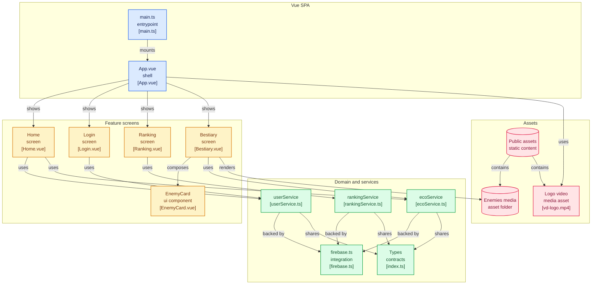

```mermaid
flowchart TD

subgraph group_runtime["Vue SPA"]
  node_src_main["main.ts<br/>entrypoint<br/>[main.ts]"]
  node_src_app["App.vue<br/>shell<br/>[App.vue]"]
end

subgraph group_features["Feature screens"]
  node_home["Home<br/>screen<br/>[Home.vue]"]
  node_login["Login<br/>screen<br/>[Login.vue]"]
  node_ranking["Ranking<br/>screen<br/>[Ranking.vue]"]
  node_bestiary["Bestiary<br/>screen<br/>[Bestiary.vue]"]
  node_enemy_card["EnemyCard<br/>ui component<br/>[EnemyCard.vue]"]
end

subgraph group_domain["Domain and services"]
  node_user_service["userService<br/>[userService.ts]"]
  node_ranking_service["rankingService<br/>[rankingService.ts]"]
  node_eco_service["ecoService<br/>[ecoService.ts]"]
  node_types["Types<br/>contracts<br/>[index.ts]"]
  node_firebase["firebase.ts<br/>integration<br/>[firebase.ts]"]
end

subgraph group_content["Assets"]
  node_public_assets[("Public assets<br/>static content")]
  node_enemy_media[("Enemies media<br/>asset folder")]
  node_logo_video["Logo video<br/>media asset<br/>[vd-logo.mp4]"]
end

node_src_main -->|"mounts"| node_src_app
node_src_app -->|"shows"| node_home
node_src_app -->|"shows"| node_login
node_src_app -->|"shows"| node_ranking
node_src_app -->|"shows"| node_bestiary
node_bestiary -->|"composes"| node_enemy_card
node_home -->|"uses"| node_user_service
node_login -->|"uses"| node_user_service
node_ranking -->|"uses"| node_ranking_service
node_home -->|"uses"| node_eco_service
node_bestiary -->|"uses"| node_eco_service
node_user_service -->|"backed by"| node_firebase
node_ranking_service -->|"backed by"| node_firebase
node_eco_service -->|"backed by"| node_firebase
node_user_service -->|"shares"| node_types
node_ranking_service -->|"shares"| node_types
node_eco_service -->|"shares"| node_types
node_bestiary -->|"renders"| node_enemy_media
node_src_app -->|"uses"| node_logo_video
node_public_assets -->|"contains"| node_enemy_media
node_public_assets -->|"contains"| node_logo_video

click node_src_main "https://github.com/sbermudo777-dotcom/the-arcane-codex-web/blob/main/src/main.ts"
click node_src_app "https://github.com/sbermudo777-dotcom/the-arcane-codex-web/blob/main/src/App.vue"
click node_home "https://github.com/sbermudo777-dotcom/the-arcane-codex-web/blob/main/src/components/Home.vue"
click node_login "https://github.com/sbermudo777-dotcom/the-arcane-codex-web/blob/main/src/components/Login.vue"
click node_ranking "https://github.com/sbermudo777-dotcom/the-arcane-codex-web/blob/main/src/components/Ranking.vue"
click node_bestiary "https://github.com/sbermudo777-dotcom/the-arcane-codex-web/blob/main/src/components/Bestiary.vue"
click node_enemy_card "https://github.com/sbermudo777-dotcom/the-arcane-codex-web/blob/main/src/components/EnemyCard.vue"
click node_user_service "https://github.com/sbermudo777-dotcom/the-arcane-codex-web/blob/main/src/services/userService.ts"
click node_ranking_service "https://github.com/sbermudo777-dotcom/the-arcane-codex-web/blob/main/src/services/rankingService.ts"
click node_eco_service "https://github.com/sbermudo777-dotcom/the-arcane-codex-web/blob/main/src/services/ecoService.ts"
click node_types "https://github.com/sbermudo777-dotcom/the-arcane-codex-web/blob/main/src/types/index.ts"
click node_firebase "https://github.com/sbermudo777-dotcom/the-arcane-codex-web/blob/main/src/firebase.ts"
click node_public_assets "https://github.com/sbermudo777-dotcom/the-arcane-codex-web/tree/main/public"
click node_enemy_media "https://github.com/sbermudo777-dotcom/the-arcane-codex-web/tree/main/public/enemies"
click node_logo_video "https://github.com/sbermudo777-dotcom/the-arcane-codex-web/blob/main/public/vd-logo.mp4"

classDef toneNeutral fill:#f8fafc,stroke:#334155,stroke-width:1.5px,color:#0f172a
classDef toneBlue fill:#dbeafe,stroke:#2563eb,stroke-width:1.5px,color:#172554
classDef toneAmber fill:#fef3c7,stroke:#d97706,stroke-width:1.5px,color:#78350f
classDef toneMint fill:#dcfce7,stroke:#16a34a,stroke-width:1.5px,color:#14532d
classDef toneRose fill:#ffe4e6,stroke:#e11d48,stroke-width:1.5px,color:#881337
classDef toneIndigo fill:#e0e7ff,stroke:#4f46e5,stroke-width:1.5px,color:#312e81
classDef toneTeal fill:#ccfbf1,stroke:#0f766e,stroke-width:1.5px,color:#134e4a
class node_src_main,node_src_app toneBlue
class node_home,node_login,node_ranking,node_bestiary,node_enemy_card toneAmber
class node_user_service,node_ranking_service,node_eco_service,node_types,node_firebase toneMint
class node_public_assets,node_enemy_media,node_logo_video toneRose
```

